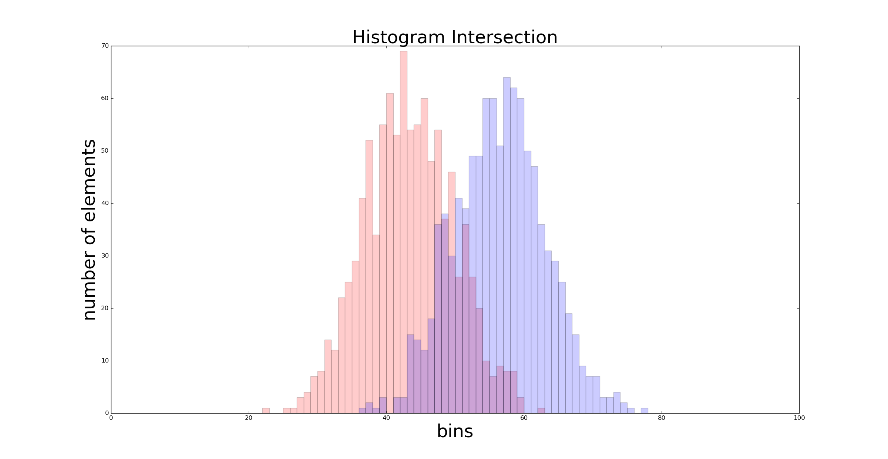

# image-search-engine
MATLAB program to search for similar images (scenes) from a set of images.

The similarity between images is calculated based on the similarity in their color histogram. This similarity can be visualized as how big the overlapping area is between the histograms of a particular channel, refer below figure:

